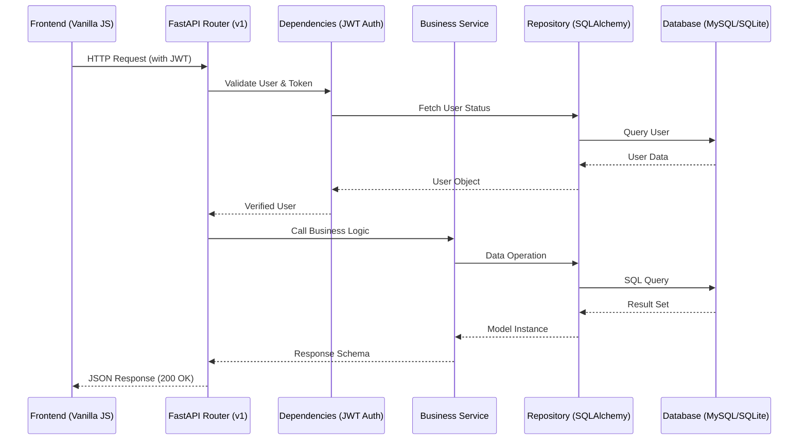

# 🛍️ Premium E-Commerce Platform

[](https://fastapi.tiangolo.com/)
[](https://www.python.org/)
[](https://www.docker.com/)
[](https://www.mysql.com/)

A state-of-the-art, modular, and secure e-commerce ecosystem. This project features a robust **FastAPI** backend and a premium **Vanilla JS** frontend designed with high-end aesthetics and modern UX principles.

## 🌟 Key Features

### 🛡️ Secure Foundation
- **JWT-based Authentication**: High-security token management with access and refresh cycles.
- **RBAC (Role-Based Access Control)**: Granular permission levels for `ADMIN` and `USER` roles.
- **Data Integrity**: Powered by SQLAlchemy 2.0 with full async support and Alembic migrations.

### 🎨 Premium Frontend
- **Design System**: A custom-built CSS design system featuring glassmorphism, smooth gradients, and micro-animations.
- **Responsive Architecture**: Pixel-perfect layouts for desktop, tablet, and mobile.
- **Dynamic Interactions**: Real-time feedback loops and state management using Vanilla JavaScript.

### ⚙️ Backend Excellence
- **Clean Architecture**: Modular structure separating API routes, business logic, and data repositories.
- **Performance Optimized**: Integrated Redis caching for lightning-fast response times.
- **Scalable Infrastructure**: Containerized with Docker and orchestrated via Docker Compose.

---

## 🏗️ Architecture Overview

The platform is built on a layered architecture that ensures separation of concerns and high maintainability.

### 1. Data Flow (Frontend to Database)



> [!NOTE]
> For a more detailed technical deep dive, including file catalogs and credential management, please refer to the [schema.md](file:///c:/Users/tonyh/Documents/GitHub/e-commerce-website/schema.md).

---

## 🛠️ Tech Stack

| Category | Technology |
| :--- | :--- |
| **Backend** | Python 3.13, FastAPI, SQLAlchemy 2.0, Pydantic, Alembic |
| **Security** | Bcrypt (Hashing), Python-JOSE (JWT), RBAC Middleware |
| **Frontend** | HTML5, Vanilla CSS3 (Custom Framework), Modern JavaScript (ES6+) |
| **Infrastructure** | Docker, Docker Compose, MySQL 8.0, Redis |
| **Testing** | Pytest, Pytest-Asyncio |

---

## 🚀 Getting Started

### 1. Prerequisites
- [Docker & Docker Compose](https://www.docker.com/get-started)
- Python 3.13+ (for local development)

### 2. Configuration
Copy the environment template and configure your secrets:
```bash
cp ecommerce-backend/.env.example ecommerce-backend/.env
```

### 3. Deployment with Docker (Recommended)
Launch the entire stack (API, DB, Redis) with a single command:
```bash
docker-compose up -d --build
```
- **API Documentation**: [http://localhost:8000/docs](http://localhost:8000/docs)
- **Frontend App**: [http://localhost:8000](http://localhost:8000) (or via your local server)

### 4. Administrative Setup
Once the system is running, seed the initial administrator:
```bash
docker-compose exec api python scripts/create_admin.py
```

---

## 📂 Project Structure

```text
├── ecommerce-backend/       # FastAPI Core
│   ├── app/                 # Main application logic
│   │   ├── api/             # V1 Endpoints & Dependencies
│   │   ├── core/            # Config, Security, Database settings
│   │   ├── models/          # SQLAlchemy Database Models
│   │   ├── repositories/    # Data Access Layer
│   │   └── services/        # Business Logic Layer
│   ├── scripts/             # Administrative Utility scripts
│   ├── tests/               # Comprehensive Test Suite
│   └── Dockerfile           # Backend Containerization
├── frontend/                # Premium Design Frontend
│   ├── css/                 # Custom Design System & Tokens
│   ├── js/                  # API Client & Page Logic
│   └── *.html               # Optimized Page Templates
└── docker-compose.yml       # Production Orchestration
```

---

## 🛡️ Security
- **Secure Password Storage**: Industry-standard Argon2 or Bcrypt hashing.
- **Stateful JWT**: Access tokens for stateless auth + Refresh tokens for persistence.
- **CORS Protection**: Configurable origins to prevent unauthorized cross-site requests.
- **Safe Environment**: Automated validation of sensitive configurations via Pydantic.

## 📊 Project Status & Team Contributions

### What's Done So Far
- ✅ **Clean Architecture:** Modular setup for models, schemas, routers, and services.
- ✅ **Database & Migrations:** SQLAlchemy and Alembic configured and working.
- ✅ **Advanced Auth & RBAC:** Full JWT token cycles (Access/Refresh), password hashing, and role-based restrictions.
- ✅ **API Documentation:** Swapped default Swagger UI for premium **Scalar** docs.
- ✅ **Caching Layer:** Redis Cache-Aside pattern natively implemented for Products/Categories.
- ✅ **Logging & Monitoring:** `loguru` structured logging running with a dedicated `/dashboard/metrics` Admin endpoint.
- ✅ **Docker Environment:** Stack is fully containerized and operational via compose.
- ✅ **Testing Base Setup:** Pytest environment fixed and JWT/Role endpoints covered!

### What's Missing / Next Steps
- 🔄 **Extensive Testing Suite:** Tests for business logic (Cart, Orders, Products) need to be completed by respective owners.
- 🔄 **Postman Collection:** Final API collection and cURL examples to be assembled.
- 🔄 **Frontend Connection:** Connecting the Vanilla JS views with the FastAPI endpoints.
- 🔄 **Business Logic Polish:** Deep testing on order state transitions and double bookings.

---

### Team Roles & Accomplishments

#### Ahmed Hussien & Tony (Lead Backend, Architecture, Integration, Bonus)
- Led the backend structure and implemented all **JWT Authentication** (Login, Register, Hashing).
- Designed the **Role-Based Access Control (RBAC)** architecture to protect routes.
- Executed core **Integration** bug fixes (resolving schema errors, repairing broken repository imports, fixing Docker test paths).
- Integrated **Scalar API Docs** and handled the **Dockerization** Bonus requirement.

#### Tena (Orders & Business Logic)
- Scaffolded Orders and OrderItems logic, transition flows, and inventory deductions limits. *(Testing & final review needed).*

#### Sondos (Products Module)
- Implemented Products CRUD operations, search, pagination, and response models.

#### Hanfy (Categories, Cart & Caching)
- Structured the Categories and Wishlist/Cart functionalities.
- Scaled the application by applying the Redis `CacheService`.

#### Mahmoud (Logging & QA)
- Managed initial Logging middleware setup and dashboard metrics, keeping watch over Postman and documentation compilation.

---

## 📄 License
This project is licensed under the MIT License.