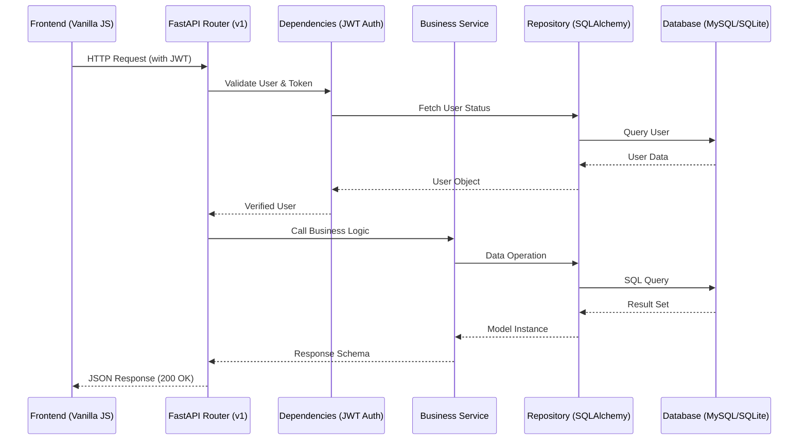
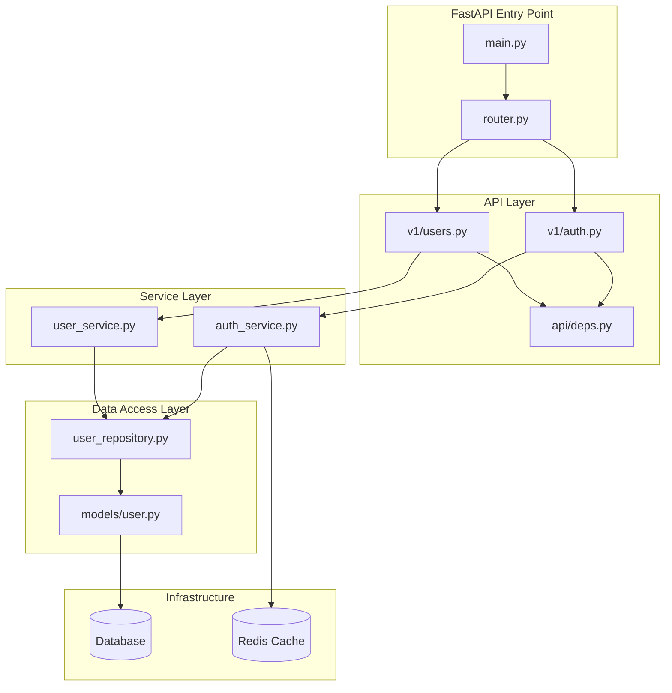

# Project Schema & Documentation

This document provides a comprehensive overview of the Premium E-Commerce platform, including its architecture, file contents, data flow, and administrative credentials.

## 🚀 Project Overview

- **Backend**: FastAPI (Python 3.13)
- **Frontend**: Vanilla JS, HTML5, CSS3 (Premium Design System)
- **Database**: MySQL (Production/Docker), SQLite (Development)
- **Cache**: Redis
- **Security**: JWT (HS256), Password hashing (Bcrypt)

## 🔑 Administrative Credentials

> [!CAUTION]
> These are the default credentials configured for the development environment. Change them in production via the `.env` file.

- **Admin Email**: `admin@ecommerce.com`
- **Admin Password**: `Admin@123456`
- **Role**: `ADMIN`

---

## 🗺️ Pipeline & Architecture Maps

### 1. Request Flow (Frontend to Database)
This diagram shows how a request is handled through the various layers of the backend.



### 2. Backend Layered Architecture
The backend follows a clean, modular architecture to separate concerns.



---

## 📂 File Catalog & Content

### 1. Backend Core (`app/core/`)

| File | Description |
| :--- | :--- |
| `config.py` | Centralized settings management using Pydantic. |
| `database.py` | Async SQLAlchemy engine and session factory. |
| `security.py` | JWT token handling and password hashing. |
| `constants.py` | Shared enums (UserRole, OrderStatus) and error messages. |

<details>
<summary><b>View core/config.py</b></summary>

```python
from pydantic_settings import BaseSettings
from pydantic import field_validator
from typing import List
import json


class Settings(BaseSettings):
    APP_NAME: str = "E-Commerce API"
    APP_VERSION: str = "1.0.0"
    APP_ENV: str = "development"
    DEBUG: bool = True
    HOST: str = "0.0.0.0"
    PORT: int = 8000
    DATABASE_URL: str = "sqlite+aiosqlite:///./ecommerce.db"
    SECRET_KEY: str = "dev-secret-key-change-in-production"
    JWT_ALGORITHM: str = "HS256"
    ACCESS_TOKEN_EXPIRE_MINUTES: int = 30
    REFRESH_TOKEN_EXPIRE_DAYS: int = 7
    REDIS_URL: str = "redis://localhost:6379/0"
    CACHE_EXPIRE_SECONDS: int = 300
    CORS_ORIGINS: List[str] = ["http://localhost:3000", "http://localhost:5500"]
    ADMIN_EMAIL: str = "admin@ecommerce.com"
    ADMIN_PASSWORD: str = "Admin@123456"
    ADMIN_FIRST_NAME: str = "Admin"
    ADMIN_LAST_NAME: str = "User"

    class Config:
        env_file = ".env"
        case_sensitive = True

settings = Settings()
```
</details>

<details>
<summary><b>View core/security.py</b></summary>

```python
from datetime import datetime, timedelta, timezone
from typing import Optional, Dict, Any
from jose import JWTError, jwt
from passlib.context import CryptContext
from app.core.config import settings

pwd_context = CryptContext(schemes=["bcrypt"], deprecated="auto")

def hash_password(password: str) -> str:
    return pwd_context.hash(password)

def verify_password(plain_password: str, hashed_password: str) -> bool:
    return pwd_context.verify(plain_password, hashed_password)

def create_access_token(data: Dict[str, Any], expires_delta: Optional[timedelta] = None) -> str:
    to_encode = data.copy()
    expire = datetime.now(timezone.utc) + (expires_delta or timedelta(minutes=settings.ACCESS_TOKEN_EXPIRE_MINUTES))
    to_encode.update({"exp": expire, "type": "access"})
    return jwt.encode(to_encode, settings.SECRET_KEY, algorithm=settings.JWT_ALGORITHM)

def decode_token(token: str) -> Optional[Dict[str, Any]]:
    try:
        return jwt.decode(token, settings.SECRET_KEY, algorithms=[settings.JWT_ALGORITHM])
    except JWTError:
        return None
```
</details>

### 2. API Layer (`app/api/`)

| File | Description |
| :--- | :--- |
| `main.py` | Application entry point, middleware, and routers. |
| `deps.py` | Dependency injection (get_current_user, get_db). |
| `v1/auth.py` | Authentication routes (login, register). |
| `v1/users.py` | User management routes (RBAC protected). |

<details>
<summary><b>View api/v1/users.py Snippet</b></summary>

```python
@router.get("/", status_code=status.HTTP_200_OK)
async def get_all_users(
    admin: User = Depends(get_admin_user),
    db: AsyncSession = Depends(get_db),
):
    user_service = UserService(db)
    # logic to fetch and return paginated users
```
</details>

### 3. Domain Logic (`app/models/`, `repositories/`, `services/`)

#### User Model (`models/user.py`)
```python
class User(Base):
    __tablename__ = "users"
    id = Column(Integer, primary_key=True)
    email = Column(String(255), unique=True)
    role = Column(SAEnum(UserRole), default=UserRole.USER)
    # ...
```

#### User Repository (`repositories/user_repository.py`)
Encapsulates SQL queries using SQLAlchemy 2.0.

#### User Service (`services/user_service.py`)
Handles business logic, validation, and error raising.

### 4. Frontend (`frontend/`)

| File | Description |
| :--- | :--- |
| `index.html` | Homepage with featured products. |
| `auth.html` | Login and Registration page. |
| `js/api.js` | Modular API client handling JWT and token refresh. |
| `css/styles.css`| Premium Design System using CSS Variables. |

<details>
<summary><b>View js/api.js</b></summary>

```javascript
class API {
    async request(endpoint, options = {}) {
        const url = `${API_BASE_URL}${endpoint}`;
        // Automatically adds Bearer token if present
        // Handles 401 Unauthorized by attempting token refresh
    }
}
```
</details>

### 5. Infrastructure

#### `docker-compose.yml`
Orchestrates three services:
1.  **API**: The FastAPI application.
2.  **DB**: MySQL 8.0 container.
3.  **Redis**: Caching layer.

---

## 🛠️ Development Scripts

- **`scripts/create_admin.py`**: A standalone script to seed the database with the default admin user defined in `.env`.

```bash
python ecommerce-backend/scripts/create_admin.py
```
